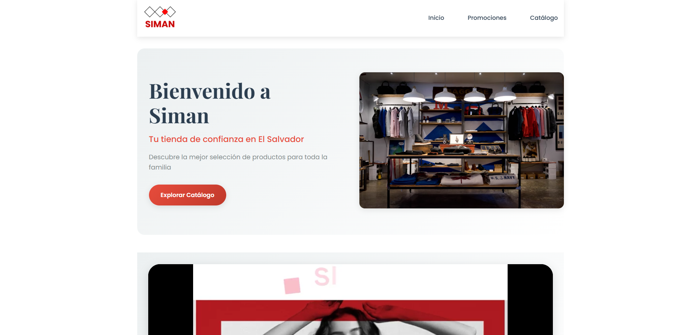
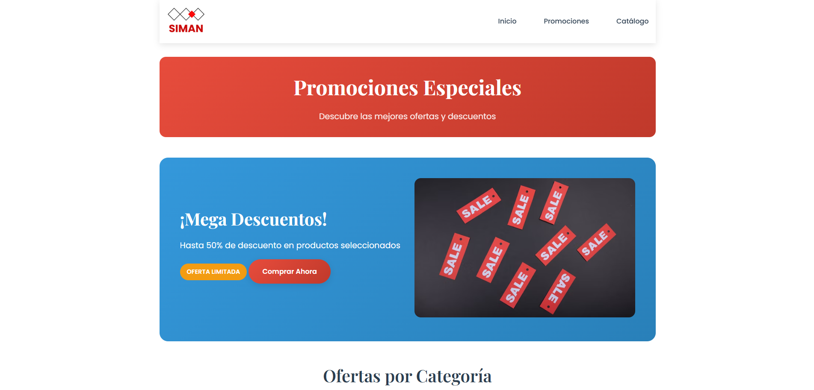
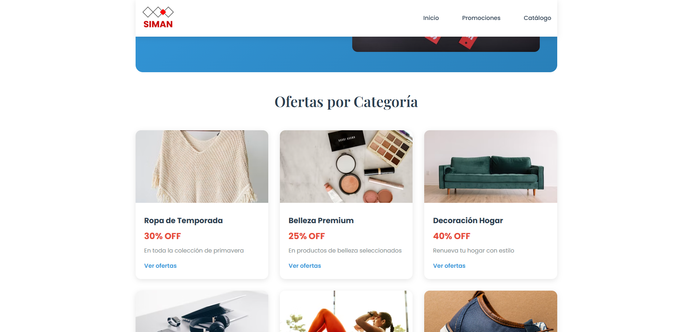
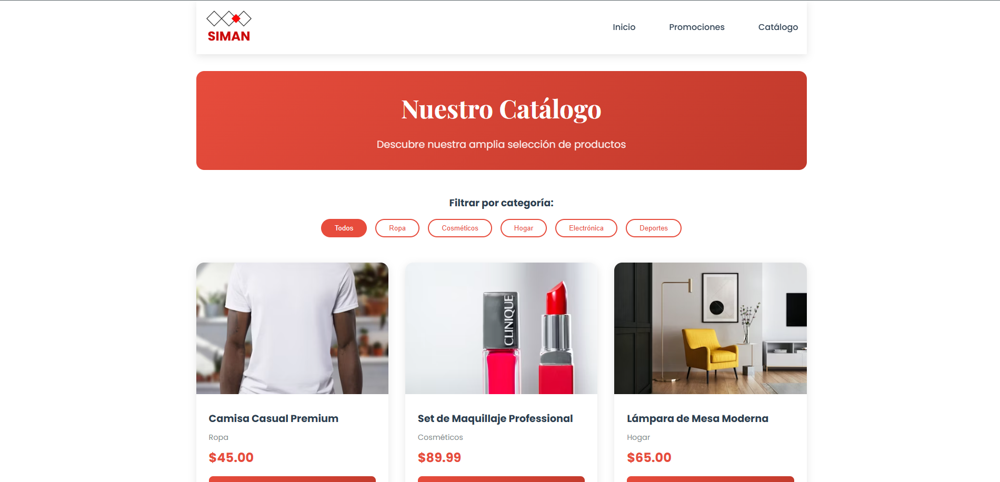
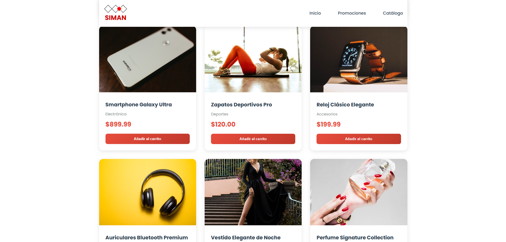

# 🛍️ LandingPage-Siman

Landing page **estática y responsiva** para una tienda tipo Siman, desarrollada con **HTML + CSS** (sin frameworks JS).  
Incluye páginas de **Inicio**, **Promociones** y **Catálogo**, navegación accesible, banners promocionales y tarjetas de producto.

<p>
  
  
  
</p>

> 🔗 **Demo:** https://landing-page-siman-one.vercel.app  
> ⚠️ **Nota:** Proyecto **educativo/no oficial**. La marca “Siman” es de sus respectivos dueños.

---

## ✨ Características
- Diseño **responsive** (mobile-first).
- **Navbar** con estado activo por página.
- Sección **Hero** con CTA y media.
- Páginas: **Inicio (`index.html`)**, **Promociones (`promociones.html`)**, **Catálogo (`catalogo.html`)**.
- Tarjetas de producto con imagen, precio y botón.
- Estructura accesible (roles/alt/semántica).

---

## 📂 Estructura
```
LandingPage-Siman/
├─ assets/
│  └─ images/          # imágenes (hero, productos, logotipos, screenshots, etc.)
├─ css/
│  └─ styles.css       # estilos globales
├─ index.html          # Home
├─ promociones.html    # Promociones
└─ catalogo.html       # Catálogo
```

---

## 📸 Screenshots


### 🏠 Home
<div align="center">
  
</div>

### 🎉 Promociones
<div align="center">
  
  
</div>

### 🛒 Catálogo
<div align="center">
  
  
</div>

---

## 🚀 Cómo ejecutar
No requiere build ni servidor backend.

**Opción A – Local**
```bash
# clonar
git clone https://github.com/<tu-usuario>/LandingPage-Siman.git
cd LandingPage-Siman

# abrir en el navegador
# (doble clic a index.html o usa un server estático)
```

**Opción B – VS Code (Live Server)**
1. Instala la extensión **Live Server**.  
2. Abre el proyecto, botón derecho sobre `index.html` → **Open with Live Server**.

---

## ☁️ Despliegue
- **Vercel:** importa el repo y selecciona como output `index.html` (sin build).  
- **GitHub Pages:** Settings → Pages → Deploy from branch → `main` / root.  
- **Netlify:** arrastra la carpeta o conecta el repo.

---

## 🧰 Personalización rápida
- **Colores/tipografía:** editar en `css/styles.css`.  
- **Logotipo:** reemplaza `assets/images/logo.png` y actualiza `alt`.  
- **Productos/CTA:** edita el contenido de cada `.html`.  
- **SEO básico:** añade/ajusta `<title>`, `meta description`, y `og:image` en cada página.

**Ejemplo de meta tags (en `<head>`):**
```html
<meta name="description" content="Tienda con promociones y catálogo para toda la familia.">
<meta property="og:title" content="Bienvenido a Siman" />
<meta property="og:description" content="Promociones y catálogo con ofertas especiales." />
<meta property="og:image" content="assets/images/og-banner.png" />
<meta name="viewport" content="width=device-width, initial-scale=1" />
```

---

## ✅ Checklist de calidad
- [ ] Todas las imágenes con `alt` descriptivo.  
- [ ] Contraste de color AA (texto sobre fondos).  
- [ ] Navegación funcional en móvil y desktop.  
- [ ] Títulos `<h1>` únicos por página.  
- [ ] Metadatos SEO por página.

---

## 📄 Licencia
MIT — uso libre con atribución.  
**Disclaimer:** Proyecto no oficial, con fines educativos.
